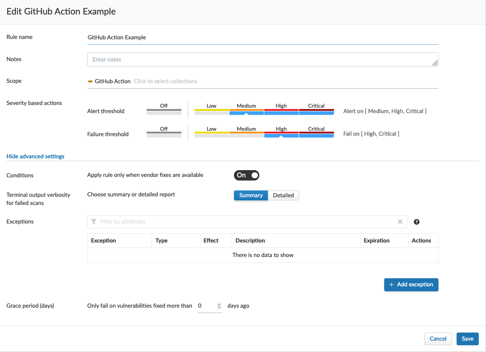
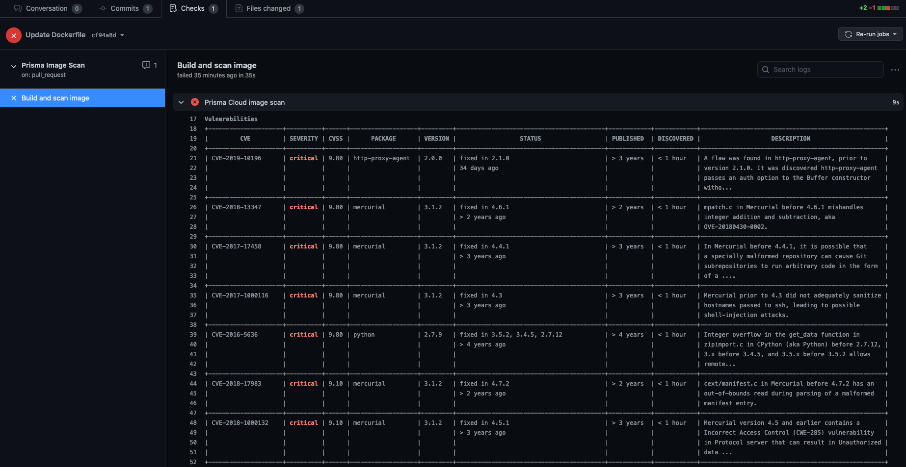
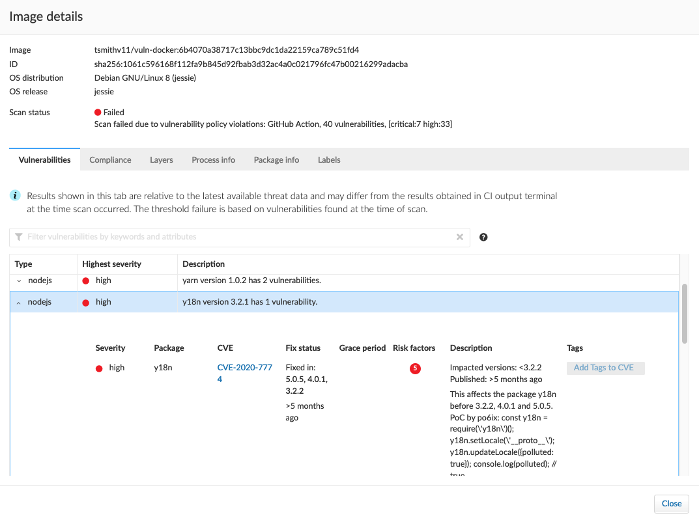
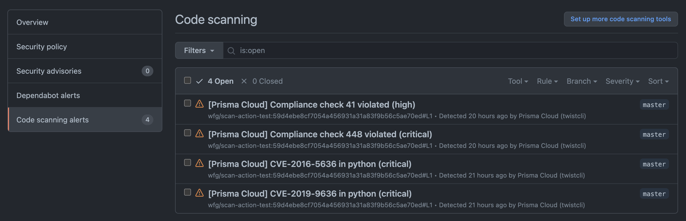

# Prisma Cloud Scan Action
This GitHub Action will scan container images for vulnerabilities and compliance issues using Prisma Cloud by Palo Alto Networks. With it, you can receive immediate feedback about image vulnerabilities and compliance violations both in GitHub and in the Prisma Cloud Console as well as block builds that do not meet your compliance requirements, such as high or critical vulnerabilities.

This action is a wrapper around [twistcli](https://docs.twistlock.com/docs/compute_edition/tools/twistcli_scan_images.html) which connects to the specified Prisma Cloud Console for vulnerability and compliance policy and metadata.

## Usage
### Example of container image scanning
```yaml
on: [ push, workflow_dispatch ]

env:
  IMAGE_NAME: ${{ github.repository }}:${{ github.sha }}

jobs:
  build-and-scan:
    name: Build and scan image
    runs-on: ubuntu-latest

    steps:
      - name: Check out the repository
        uses: actions/checkout@v2

      - name: Build the image
        run: docker build -t $IMAGE_NAME .

      - name: Prisma Cloud image scan
        id: scan
        uses: PaloAltoNetworks/prisma-cloud-scan@v1
        with:
          pcc_console_url: ${{ secrets.PCC_CONSOLE_URL }}
          pcc_user: ${{ secrets.PCC_USER }}
          pcc_pass: ${{ secrets.PCC_PASS }}
          image_name: ${{ env.IMAGE_NAME }}

      # (Optional) for compatibility with GitHub's code scanning alerts
      - name: Upload SARIF file
        if: ${{ always() }} # necessary if using failure thresholds in the image scan
        uses: github/codeql-action/upload-sarif@v1
        with:
          sarif_file: ${{ steps.scan.outputs.sarif_file }}
```


## Properties
### Environment variables
| Variable         | Description                                                                                                   | Required? | Default |
|------------------|---------------------------------------------------------------------------------------------------------------|---|---|
| `DOCKER_ADDRESS` | Address of the Docker daemon (e.g. tcp://localhost:2375)                                                      | No |  |
| `DOCKER_HOST`    | Address of the Docker daemon (e.g. tcp://localhost:2375). `DOCKER_ADDRESS` takes priority. | No |  |

### Inputs
| Input | Description | Required? | Default |
|---|---|---|---|
| `pcc_console_url` | URL of your Prisma Cloud Compute Console | Yes |  |
| `pcc_user` | Username of a user with the CI user role | Yes |  |
| `pcc_pass` | Password of a user with the CI user role | Yes |  |
| `image_name` | Name (or ID) of the image to be scanned | Yes |  |
| `results_file` | File to which scan results are written in JSON | No | `pcc_scan_results.json` |
| `sarif_file` | File to which scan results are written in SARIF | No | `pcc_scan_results.sarif.json` |
| `docker_address` | Address of the Docker daemon (e.g. tcp://localhost:2375) | No |  |
| `docker_tlscacert` | Path to the Docker CA certificate | No |  |
| `docker_tlscert` | Path to the Docker client certificate | No |  |
| `docker_tlskey` | Path to the Docker client private key | No |  |

### Outputs
| Output | Description |
|---|---|
| `results_file` | File to which scan results are written in JSON |
| `sarif_file` | File to which scan results are written in SARIF |

## Control alerting and fail thresholds
You can set the level for alerting and failing builds in the Prisma Cloud UI. For example, setting the alert threshold to Medium will not alert for Low severity vulnerabilities.



## Results output
The table of discovered vulnerabilities and compliance violations shows up in the GitHub workflow log and in the Prisma Cloud Console in the Monitor section. If you [upload the outputted SARIF file to GitHub](https://docs.github.com/en/code-security/secure-coding/integrating-with-code-scanning/uploading-a-sarif-file-to-github), you will also populate the code scanning alerts section in your repository. While the code-scan-to-image-scan mapping isn't perfect, it does provide all available information of each vulnerability and compliance issue. The alerts will automatically close once the issues are fixed and the workflow is ran again.

### GitHub workflow log


### Prisma Cloud Console view


### GitHub code scanning alerts


## Support
Please read [SUPPORT.md](SUPPORT.md) for details on how to get support for this project.
